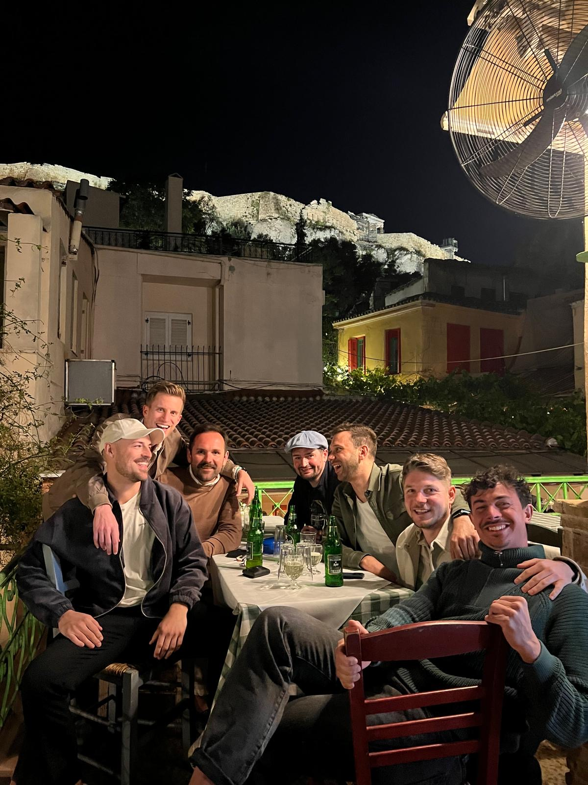

## Big 7 goes... 2025

<!--  -->

Da sind wir wieder! Und (fast) vereint in einer der schönsten Destinationen auf unserem Planeten - rau und ehrlich, genauso wie die Big7!

stay tuned...

# Nur noch so lange müssen wir uns gedulden...

Eine kleine Historie gefällig? [Hier](historie.md) geht es zu eindrucksvollen, lehrreichen, denkwürdigen und abstoßenden Impressionen der letzten gemeinsamen Jahre.

Na, neugierig? Ihr wollt wirklich wissen, wo es hingeht? Vielleicht helfen euch die [Fakten](fakten.md) über unser zukünftiges Ziel ja weiter...

Hier ein paar Anhaltspunkte, was in den Koffer sollte: [Packliste](packliste.md)
